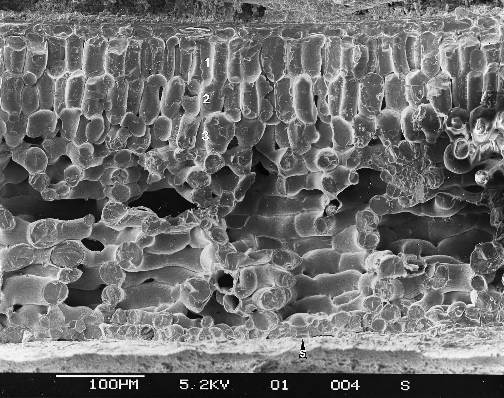
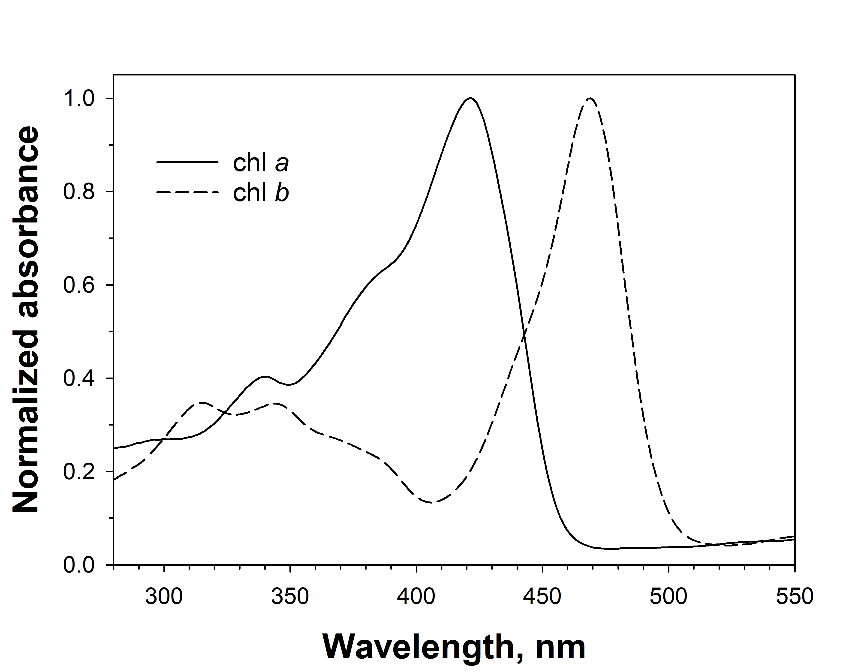
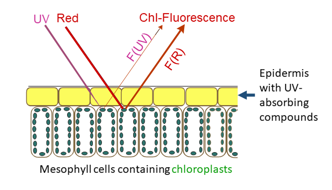
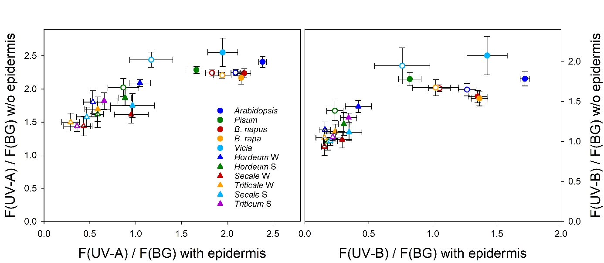

## Introduction to leaf optics

The optical properties of whole leaves depend on the pigment content and the localization of these pigments, but there is also a large contribution of tissue structural properties that through light scattering increase the distance travelled by photons within leaves\ [@Johnsen2011; @Lee2010]. Uneven distribution of pigments has also consequences for the relationship between concentration and light absorption. Absorption of photons by chlorophylls and auxiliary pigments is a pre-requisite for photosynthesis. Non-photosynthetic pigments are also important as they can screen potentially damaging UV photons. Photoreceptors are in too low a concentration to significantly affect optical properties of leaves, but the properties of light that inpings on them is affected by these properties interacting with their localization.

::: {label=fig-photo-cryofracture-hedera}
{width=100%}

Cross-section of an ivy (_Hedera canariensis_) leaf. Scanning electron miscroscope image of a cryofractured leaf\ [from @Aphalo1991].
:::

Many studies have indicated that UV-absorbing compounds in the vacuoles of epidermal cells have a major role in regulating internal UV levels. However, absorbing compounds located in cell walls and other cell parts can also be important in controlling internal UV penetration. These compounds are usually not easily extractable, and consequently one cannot rely on extracts alone when judging the effectiveness of UV-screening protection. Furthermore, both wax deposits and pubescence may be very important for protection against ultraviolet radiation\ [@Karabourniotis1999; @Holmes2002]. The amount of protection can also vary over time, even during the day, probably as a result of changes in flavonoid concentrations\ [@Barnes2008a; @Veit1996]. The expression of these protection mechanisms is plastic, i.e., subject to acclimation. Thus, expression of leaf properties conferring protection also depend on environmental factors, in particular prior exposure to UV radiation or strong visible radiation, and large differences in genotype and phenotype exist among plant species and to a lesser extent within species.

As absorbed radiative energy contributes to the energy balance of leaves, the evolution of leaf optical properties in hot climates has been influenced by features that help prevent excessive warming of leaves\ [@Lee2010]. In addition to tissue and cell damage by extreme temperatures, the rates of transpiration, photosynthesis and respiration depend on temperature. 

This chapter is organized broadly around optical properties relevant to photosynthesis, screening of UV radiation and the energy balance of plants. We also describe the application of similar methods to the description of the optical properties of flowers.

## Whole leaves

### Spectroscopy

Spectroscopy of reflected radiation is the basis of optical remote sensing, in the case of drones, aeroplanes and satellites. Spectroscopy can be also a very useful measuring approach at the scale of individual plants and plant organs, including leaves. Reflectance, absorptance and transmittance of whole leaves and flower petals and sepals informs about combined effects of pigments and structural features.

It is important to remember when studying plants that light scattering plays a very important role in determining optical properties\ [@Lee2010]. One possible way of quantifying scattering within leaves is to measure the time a very brief laser pulse takes to travel across a leaf, from adaxial to abaxial epidermis (L.O. Björn, personal communication). A way of visualizing the contribution to light scattering of the water-air interfaces within leaves is to infiltrate the air spaces with water in a vacuum chamber. If we infiltrate a variegated leaf, the white parts lacking chlorophyll turn almost transparent and the dark green regions containing chlorophyll become semi-transparent with a green tint. This demonstrates that scattering increases the probability of photons being absorbed. This increase results from lengthening the path of photons within the leaf and a concomitant increase in the probability of each photon being intercepted by a pigment molecule.

The surface of leaves varies among species and also through acclimation within a single genotype or even parts of an individual. Not only pubescence and whitish wax deposits on the surface of leaves affect reflectance, also the shine of the surface resulting from its smoothness affects how reflectance varies with the light incidence angle. Phenomena at the surface interface affect light passage in both directions, both in-going and out-going photons. This is probably why only leaves that receive light equally from both sides have similar surface and epidermal properties in adaxial and abaxial epidermes. Surface properties also affect wettability, accumulation of dirt and interactions with insects and microbes. In the case of flowers, not only pigments play a role in their colours. In some cases, very-small-scale surface properties contribute to enhancing their colours, or even creating them by interference effects. In general, colours generated through interference by micro-structure vary with the angle between a light beam and the surface, e.g., petal or leaf epidermis. We see this incidence-angle-dependence as iridescence. For example, the colour of tulip flowers is based on pigments but intensified by structural features at the surface.

For spectroscopic measurement of optical properties we need a light source, references, and a spectrometer. Measurements are relative to reference standards, e.g., white standard tiles with very high and known spectral reflectance across all wavelengths of interest. The light source must have a stable and consistent enough light output to allow comparable sequential measurements. As reference standards are used for each measurement, the spectrometer needs to be calibrated for wavelength and a linearization function available. However, an irradiance calibration is not needed. There are two approaches in common use to collect the reflected light, a probe with a narrow aperture angle, or an integrating sphere. With a probe, we measure only part the the reflected light, collinear with the incident light beam, but possibly at different angles to the surface of the leaf. When using an integrating sphere, the incident beam is most frequently within 10 degrees of normal to the surface, and the integrating sphere collects radiation reflected in all directions. These two approaches provide measurements that are **not comparable**. Furthermore, the effect of physical surface properties on them is different.

The best material for reference "tiles" is Spectralon, a fluoropolymer. It exhibits highly Lambertian behavior, and very high reflectance ($>0.95$ from 250 nm to 2500 nm). Spectralon is fairly tolerant of handling, thus in this respect better than Barium sulphate in the form of compacted powder or sprays. Sets of Spectralon tiles with different _calibrated_ reflectance values are commercially available, with tiles of different strengths having each a nearly constant reflectance across a wide range of wavelengths. Their drawback is that they are expensive, even at small sizes, and that must the handled carefully so as not to affect their calibrated reflection properties. For measuring low reflectance values accurately, the use of "grey" tiles of comparable reflectance to the object measured is recommended, as using a white tile assumes perfect linearity of the spectrometer's response. Grey Spectralon tiles contain some carbon black to decrease reflectance. A set of four 1.25" tiles, white, and grayscale costs over $1\,500$€ uncalibrated, and nearly $2\,000$€ with a traceable calibrating (early 2025 prices). In addition to white, black and grey reference tiles, colour reference tiles and even fluorescence reference tiles are commercially available. For example, sets of colour reference tiles or "colour checkers" are used in photography to ensure faithful colour reproduction. 

While for accurate (spectral) reflectance measurements we need reference tiles, for transmittance, in practice we normally block the light path or remove of the measured object out of the path, once again assuming linearity. A calibrated neutral density (ND) filter can play a similar role as a grey tile for reflectance. Absorptance, is calculated by difference from the measured spectral reflectance and transmittance. See chapter [_Radiation-matter Interactions and Optics_](optics.qmd) for the theory and calculation details.

::: callout-tip
### Alternative white references

Because high quality calibrated reference tiles are expensive and small in size, as with other types of references, it is possible to use derived references, i.e., working references calibrated by comparison to a more accurate one. In many situations, such as when all measurements to be compared are done with the same instrument an protocol, relative accuracy is more important than absolute accuracy. In other cases such as when measuring long time series, minimizing the use of the master reference is important, so as to ensure that the accuarcy of this reference does not deteriorate in time because of frequent use. When larger reference tiles are needed than those commercially available or than those that can are within budget, derived references can be used as a substitute for them.

A substitute for a white Spectralon standard is a slab of commercial grade fluoropolymer PTFE (e.g., Teflon) > 6 mm thick. In fact, Spectralon is made of synthered pure PTFE powder, with enhanced scattering properties. Only high quality non-recycled PTFE is pure enough to be used as a white reference. The need for a thicker slab of solid PTFE to subtitute for Spectralon is because it scatters light less. The best approach is to use a Spectralon tile as a reference to measure the PTFE tile, i.e., transferring the calibration from a known-good standard to much cheaper working standards. All references must scatter the light they reflect, so their surface must look mat rather than shiny. To prevent specular reflections from the surface of PTFE slabs, their surface must be wet-sanded with a fine grit (e.g., 600) sand paper. A solid PTFE slab can be washed to clean it, and even sanded again if its surface gets marred. **White paints are in many cases unsuitable as they frequently contain fluorescent pigments to enhance their apparent reflectivity, and thus modify the spectrum of the incident light that they reflect.**

A substitute for a calibrated black tile can be based on black flocking as used on the inside of optical instruments, special black paint used for this same purpose, or special artist's black paints. Flocking is similar to velvet in that black fibres perpendicular to the surface "trap" incident light, best ones achieving $R_\mathrm{VIS} \approx 0.005$, but others $R_\mathrm{VIS} > 0.02$. Paints must provide a fully mat, or scattering, surface once dry. As with PTFE slabs, the reflectance can be compared to that of calibrated black standard. One approach to creating extremely black coatings is to use special carbon nanotubules to trap photons. Special black paints, when evenly applied, usually in multiple coats, can achieve $R_\mathrm{VIS} \approx 0.001$. Artists' paint sold under the name of _Black 3.0_  from [Culture Hustle](https://culturehustle.com/) has very high absorbance in both visible ($R_\mathrm{VIS} < 0.01$) and NIR regions of the spectrum (This supplier has provided PJA with spectral data showing that the blackness of Black 3.0 extends into the NIR.) _Black 4.0_ also from Culture Hustle might also work as it is even less reflective in the visible, but I lack spectral data for it and its surface has been reported as fragile. [_Musou Black_](https://www.musoublack.com/) is NIR reflective but might be useful in VIS. There is a compromise, as the more pigment a paint contains the more fragile the painted surface becomes. _Black 3.0_ is non-toxic while _Musou black_ is reported to have an obnoxious smell. Of course, using secondary black standards will always degrade accuracy compared to using calibrated tiles, specially in the case of measuring dark surfaces. 

Recipes for making substitute grey references have been published (@Crowther2018). Data on the spectral reflectance of various materials in the range $250 < \lambda < 2500$ nm was published by @Marshall2014a in reletion to instrumentation used in astronomy.

:::

### Optical estimation of chlorophyll content

As explained above, both pigments and scattering affect transmittance in a heterogeous medium such as leaves. A simple measurement of leaf transmittance at a wavelength where chlorophyll absorbs strongly enough provides a rough estimate of the concentration of chlorophyll, that can be used with a suitable case-specific calibration. This requires very simple equipment, but is rather impractical as readings are highly dependent scattering within leaves. Two commercially available instruments, the SPAD-502Plus (Konica Minolta), CCM-200 (Opti-Sciences) and the Dualex 4.0 (METOS, Pessl Instruments) apply a correction based on the transmittance in the NIR, where leaves have very low absorptance and scattering predominates. The Dualex 4 measures transmittance at a wavelength in the NIR (near 710 nm, i.e., close to the so-called "red edge"), thus outside the region of maximum absorption of chlorophylls, using an even longer wavelength (near 820 nm) as reference for scattering. In contrast, the CCM-200 uses 653 nm and 931 nm, and the SPAD-502 uses the very similar 650 nm and 940 nm. So these instruments measure absorbance in the red where chlorophyll absorption is higher than at 710 nm, while using a reference in the NIR. In all cases, using a reference-based correction for scattering makes the calibration against chlorophyll concentration _less_ dependent on leaf anatomy and species. Thus, for within-experiment comparisons, in many cases it is possible to rely on calibrations that are only instrument dependent (@Markwell1995). Still, for accurate measurements expressed as chlorophyll concentration per unit leaf area, a calibration against photometric measurements in leaf extracts can be necessary. The values returned by the SPAD instrument are in arbitrary units and their relationship to concentration is slightly curvilinear. The Dualex returns approximate concentration values in $\mu g\, cm^{-2}$ based on a built-in _generic_, and thus, approximate calibration. The relationship between these estimates and true concentration is linear in the case of the Dualex.

::: callout-note
### Principle of operation

A small light source and a light detector located on opposite sides of the leaf can provide an estimate of **leaf transmittance**. The simplest possible approach to estimate chlorophyll concentration _in vivo_ is to use a red LED (660 nm), or NIR (710 nm), and a silicon photodiode. A LED driver must ensure stable illumination and the current generated by the photodiode can be measured with a suitable ammeter, or using a shunt resistor, measured with a sensitive voltmeter. Such a device can in many cases assembled at minimal expense, and if used in a darkened room the only key requirement is consistent alignment between LED and photodiode. However, a calibration curve must be measured over a range of known chlorophyll concentrations extracted from leaves and repeated for each species, genotype and experiment, possibly even treatments. This approach works (e.g., @Casal1987 and\ [@fig-BROCHE]) but because of the need of frequent calibrations, it is tedious in practice.

::: {#fig-BROCHE-SPAD}

The device used by @Casal1987 was crudely built using a wood cloth-peg into which holes were drilled to install a LED and a photodiode into opposite halves. 
:::

Most commercial instruments use this same approach but with two light sources, as described above, one used to measure the decrease in transmittance not attributable to chlorophyll (in NIR) and one to estimate this effect together with that attributable to chlorophyll (in red or nearby region). The principle remains the same, but using absorption of NIR as a reference makes calibrations less dependent on those leaf properties that affect absorption but are unrelated to the concentration of chlorophyll. These chlorophyll meters also have a small light-tight chamber to avoid interference from ambient light. To improve this separation even further, a wavelength selective filter on the photodiode can be used to isolate the wavelengths emitted by the LED(s) from those in ambient light. It should be mentioned here, that paired measurements in the red and NIR regions are also strongly recommended when measuring chlorophyll extracts in the lab with a spectrophotometer. The stability of Konika-Minolta SPAD-502 and Opti-Science CCM-200 readings among units and across species has been reviewed\ [@Parry2014]. A significant effect of chloroplast accumulation on SPAD readings has been reported\ [@Hoel1998], and should be taken into account when designing measuring protocols.
:::

The variability of non-destructive _in situ_ optical estimates is rather high making abundant replication important both for measurements and calibration curves (e.g.,\ [@fig-spad-baobabs]). On ther other hand, measurements take only a few seconds and being non-destructive, the same leaves can be repeatedly measured over their life.

```{r, echo=FALSE,include=FALSE,message=FALSE}
#| label: SPAD-calibration

library(ggpmisc)

# read the data from Excel csv file
Chl.data <- read.csv("data/SPAD-chl-callibration-baobabs.csv")

# This is what I think is best and refer to in my e-mail

Chl.mod.log <- 
  nls(log10(ChlTot) ~ log10(10^(SPAD^beta1)),
      start=list(beta1=0.265), trace=TRUE, data=Chl.data)
# summary(Chl.mod.log)
```

```{r}
#| label: fig-spad-baobabs
#| fig-cap: Fitted SPAD-502 callibration curve for three species of Malagasy baobab (_Adansonia_). _A. grandidieri, A. madagascariensis, A. rubrostipa_.  Reference total chlorophyll concentrations from extracts in _N,N_-dimethylformamide measured spectroscopically [see @Randriamanana2012].

library(ggplot2)

ggplot(Chl.data, aes(SPAD, ChlTot, color = species)) +
  geom_point() +
  stat_function(fun = function(x) {exp(log(10^(x^0.2672137)))}, 
                color = "black", xlim = range(Chl.data$SPAD)) +
  annotate(geom = "text", x = 0, y = 1250, 
           label = "10^italic(S)^0.2672", 
           parse = TRUE, size = 5, hjust = "inward") +
  labs(x = expression("SPAD Index,"*italic(S)), 
       y = expression("Chlorophyll "*(mu*mol~m^{-2})),
       colour = "Baobab species:") +
  theme_bw(16) + theme(legend.position = "top")
```

Variability and consequent uncertainty increase as the chlorophyll concentration increases because the number of target photons reaching the detector decreases making the relative effect of other optical and electronic disturbances larger. In the Dualex 4.0, the measurement of transmittance at the shoulder rather than at the top of the peak of absorption decreases this problem. Being the basic principle simple, several competing devices are available for measuring chlorophyll _in vivo_ . For example, this is one of the parameters measured by the Walz [LSA-250](https://www.walz.com/products/chl_p700/leaf-state-analyzer/) _leaf state analizer_ using the same approach as in the Dualex, and by the Opti-Science [MPM-100](https://www.optisci.com/mpm-100.html) multi pigment meter. **I NEED TO FIND OUT WHAT WAVELENGTHS ARE USED BY THE MPM-100**, possibly also close to 710 nm. The functions of these instruments dependent on using chlorophyll fluorescence as a reporter of UV screening are described in a later section. 

The SPAD-502, CCM-200 and Dualex-4 are good examples of two frequently used approaches, but given the usefulness of in-vivo chlorophyll measurements, there are additional instruments available. Opti-Sciences current CCM-200Plus chlorophyll meter, returns Chlorophyll Content Index (CCI) values. In contrast, Apogee's extrenally almost identical [MC-100]() chlorophyll meter uses a built-in calibrations for multiple plant species, reporting area-based chlorophyll concentrations in $\mathrm{\mu mol}\,\mathrm{m}^2$ of leaf surface, while also able to report results in SPAD and CCI units. Other SPAD quasi-clones are available: Hansatech [CL-01](https://www.hansatech-instruments.com/product/cl-01-chlorophyll-content-meter/) Chlorophyll Meter (660 nm, 940 nm), using its own uncalibrated units for expressing concentration values, In addition, several different chlorophyll meters are available from different suppliers, including AliExpress for a low price of 300 to 500 €. Most of them, look externally like clones of the SPAD, and return values in SPAD units. Seevral of them, even if sold under different brand names, and showing slight variations in external appearance seem to be functionally almost identical. A recent study suggests that at some of these cheap instruments are able to provide as good estimates of chlorophyll concentrations as the SPAD-502 or the CCM-200\ [@Brown2022]. For a chlorophyll meter to provide readings in SPAD units consitent with those reported by the SPAD-502, they must use the same, or very similar, wavelengths to the SPAD-502.

Of course, spectral transmittance can be used to estimate chlorophyll concentration in vivo [e.g., @Casal1987]. However, estimates from the simpler instruments described above seem to be as good once a calibration is used\ [@Brown2022].

It is also possible to estimate chlorophyll concentration from reflectance. This is possible as a result of light scattering. Some of the photons entering the leaf and scattered within it will exit through the same epidermis through which they entered into the leaf, creating a spectral signature in the apparent reflectance dependent on the concentration of chlorophyll. This approach is in practice used when transmittance cannot be measured, for example, in remote sensing. 

### Monitoring of chloroplast accumulation

- Pawel and Justyna (?)

## Fibre-optic measurements

This method was introduced for visible light by @Vogelmann1984, and has been adapted for ultraviolet radiation by Vogelmann, Bornman and coworkers\ [@Bornman1988; @DeLucia1992; @Cen1993]. The method cannot be used for absolute measurements due to uncertainties about the local conditions and the acceptance angle at the fibre tip, but it has yielded valuable comparisons between attenuation of different wavelengths and the resulting depth profile of radiation within leaves. Fibre probes can be made less angle-dependent\ [@Garcia-Pichel1995], but then become too bulky for measurements inside plant leaves.

NEEDS DETAILS AND CHECKING OF ANY MORE RECENT USES.

## Chlorophyll fluorescence as a reporter of UV screening

### Old text (to merge below or delete)

This method has so far only been employed by excitation and measurement at the leaf surface. It thus mainly monitors penetration of UV radiation through the epidermis into the chlorophyll-containing mesophyll, i.e. transmission through the epidermis. Chlorophyll fluorescence excited by blue light usually serves as a standard\ [@Bilger1997; @Bilger2001], more recently excitation by red light has also been used to avoid interference by anthocyanins\ [@Goulas2004]. The principle has been used in commercial instruments that assess the UV [absorbance]{acronym-label="absorbance" acronym-form="singular+short"} of the epidermis\ [@Kolb2005; @Goulas2004]. The first portable instruments, *UVA-PAM* and *Dualex FLAV* used UV-A radiation for excitation rather than UV-B radiation, but now there is at least one instrument, *Dualex HCA*, measuring UV-B absorbance.

In principle, chlorophyll fluorescence could also be used for monitoring UV penetration in another way, by recording fluorescence in cross-sections of leaves, as has already been done for the penetration of visible light\ [@Vogelmann2000; @Vogelmann2002; @Gould2002].

### Introduction

For protection against the detrimental action of UV radiation plants use UV absorbing compounds which are located primarily in external tissues such as the epidermis of leaves. There, they act as filters, or "screens", protecting the sensitive targets of UV radiation in the tissues below. The extent of this protection is strongly dependent on environmental conditions (Pescheck & Bilger 2020), especially exposure to UV-B radiation, high light and low temperature, but also nitrogen deficiency and high CO2 concentrations enhance the synthesis and accumulation of UV screening compounds. In addition, screening may change during the development of leaves. Therefore, it is a priori unknown if two different leaves of the same species display also the same UV protection. However, for the reproducibility and interpretation of experiments testing the UV sensitivity of plants, it is important to know the amount of radiation absorbed in the epidermis before it can reach sensitive targets within the leaf. On the other hand, the effects of the environment on the accumulation of screening pigments can be much easier studied, when the latter can be determined in intact plant leaves.

First determinations of the depth to which UV radiation penetrates into a leaf were accomplished using fine quartz fibres, which were slowly led through a leaf (Bornman and Vogelmann 1988). This technique is very elaborate, requiring, e.g., a precise measurement of the depth of penetration, such that only very few laboratories in the world were able to apply it. Furthermore, the technique is destructive and requires rather stable research objects. It cannot be used with mosses or algae.

A method restricted to even fewer plants species in which large-enough pieces of epidermis can be peeled or dissected is to directly measure spectral transmittance of the isolated epidermis with a spectrometer\ [@Barnes2015a]. This not only involves the in many cases difficult task of separating the epidermis, but also maintaining its integrity during the course of the measurements. 

The drawbacks of these methods are avoided by a technique, which uses chlorophyll fluorescence excitation by a UV measuring beam\ [@Bilger1997]. Based on the measuring principle described below, several commercially available devices were developed, of which the Dualex Scientific originally manufactured by Force A (France) in various versions, has been the most popular in recent years. This technique takes advantage of the high transmittance of the epidermis in the visible region, including those of the chlorophyll fluorescence. 

### UV-induced chlorophyll fluorescence as a reporter

The measuring principle of all devices basing on chlorophyll fluorescence excitation depends on two preconditions. First, the chlorophyll fluorescence intensity is proportional to the irradiance absorbed by the chlorophyll and a yield factor, which is dependent on the state of photosystem II. (To be correct, also the state of PS I may have a certain influence. This is, however, only relevant at high excitation densities, which are not used here. Therefore, PS I fluorescence contributes with a constant fraction to the fluorescence intensity.) As long as the electrons transferred by PSII to the primary acceptor QA do not accumulate there, the yield factor remains constant. This is the case when the light received by PS II is sufficiently weak. Then, the fluorescence intensity is dependent only on the number of quanta reaching the chloroplasts.

::: {label=fig-chl-bilger}

{width=80%}

Normalized absorbance spectra of chlorophyll _a_ (isolated from _Asterocapsa nidulans_ (N.L. Gardner) Komárek & Komárková-Legnerová) and chlorophyll _b_ (purchased from Sigma-Aldrich) in 100% methanol.
:::

Second, chlorophyll must absorb UV radiation. This is indeed the case, as absorption spectra of chlorophyll _a_ and _b_ reveal (@fig-chl-bilger). Given these facts, the fluorescence yield of a (UV) measuring beam depends on the fraction of it that reaches chloroplasts. In higher plant leaves, the measuring beam must pass the epidermis, which is largely free of chloroplasts, before chlorophyll fluorescence can be excited. Hence, UV absorbing compounds located in epidermal vacuoles or cell walls will affect fluorescence emission. In lower plants, such as ferns and algae, UV absorbing compounds located in external cell walls can fulfil this function (e.g., Pescheck et al. 2014). Since fluorescence emission is also affected by independent factors such as the measuring geometry, the amount of chlorophyll in the leaves, scattering properties of the anatomical structure of the leaves, or in some measuring arrangements simply by the sample size, a reference beam is used which is similarly affected by these factors but not absorbed by screening pigments. In the early measuring apparatus, a blue reference beam was used (Bilger et al. 1997, 2001), since it was assumed that at this wavelength scattering within the leaf would be most similar to the scattering of the UV measuring beam. Later it was recognized that the fluorescence yield of a blue beam is dependent on the amount of the xanthophyll cycle carotenoids in the chloroplasts (Pfündel et al. 2007, Nichelmann et al. 2016), and a red reference beam is used nowadays.\ [@fig-fluor-principle-bilger] shows a scheme of the measuring principle as implemented in the UVA-PAM and Dualex. In the UVA-PAM, both excitation and measurement take place on the same epidermis, while in the Dualex, the fluorescence is detected on the opposite surface of the leaf. Both excitation beams have to pass the epidermis. UV absorbing pigments in the epidermis reduce the intensity of the UV beam, whereas this is not the case for the red reference beam. The latter as well as the emitted chlorophyll fluorescence will not be absorbed in the epidermis and be similarly scattered by it. 

::: {label=fig-fluor-principle-bilger}

{width=80%}

Schematic illustration of the measuring principle showing the cross section of the upper cells of a leaf. UV-absorbing compounds in the epidermis attenuate the UV excitation beam, whereas the red excitation beam and the chlorophyll fluorescence excited by the two beams are passing the epidermis unhindered. The ratio between UV- and red-excited fluorescence, F(UV) / F(R), is dependent on the amount of UV-absorbing compounds between the leaf surface and the chloroplasts.
:::

We need a whole-leaf cross section and to distinguish the approach currently shown, used in the UVA-PAM and the approach used in the Dualex with fluorescence assessed on the opposite side of the leaf. We need also to find-out what approch is used ib the LSA-2050, the MPM-100  and other readily available chlorophyll meters.

### Calculating UV transmittance

The ratio of the UV-induced fluorescence to the red-induced fluorescence (F(UV) / F(R)) is also dependent on the intensities of the measuring beams. In order to calculate a transmittance of the UV beam, it is necessary to know F(UV) / F(R) induced in the absence of any absorbing pigments with identical measuring beam intensities. For most investigated plants, such a state cannot be reached easily. Therefore, various approaches have been used to come as close as possible to such a reference value for 100% transmittance. In our hands, Epipremnum aureum growing in a room far away from a window showed 100% UV-A transmittance and high UV-B transmittance on the adaxial leaf side. However, such high transmittances are extremely exceptional. In the vast majority of plant species, it would be necessary to remove the epidermis, which again is not possible in most plants. However, there exist species where at least the abaxial epidermis can be removed, and in some cases, this is even possible with the adaxial epidermis. Especially plants with succulent or at least slightly succulent leaves are amenable. To these plants belong many species from the family Crassulaceae, but also Vicia faba, Pisum sativum and Viola tricolor. Primary leaves from grasses, such as Hordeum vulgare, proved successful for peeling the epidermis. At growth conditions strongly inducing the formation of screening compounds, these may accumulate also in mesophyll cells (Agati et al. 2011). Therefore, shade acclimated leaves grown at optimal temperatures should be used for the 100% transmittance standard. 

:::  {label=fig-fluo-ratios-bilger}

{width=100%}

Fluorescence excitation ratios determined with a Xe-PAM fluorometer (Walz, Effeltrich, Germany; Bilger et al. 1997) from 5 dicotyledoneous species (circles) and 6 varieties from 4 monocotyledoneous species grown from fall 2000 to spring 2001 at Ås, Norway, in a phytotron at 21°C (closed symbols) or at 9°C (open symbols). Excitation ratios using a UV-A beam (left panel) or a UV-B beam (right panel) with reference to a broad blue-green (BG) excitation beam were determined from abaxial sides of leaves before (x-axis) and after (y-axis) removal of the epidermis. The following species and varieties were used: Arabidopsis thaliana acc. Columbia, Pisum sativum subsp. sativum cv. axiphium, Brassica napus cv. Bambu, Brassica rapa cv. Agneta, Vicia faba cv. Witkiem, Hordeum vulgare cv. Frost, H. vulgare cv. Tyra, Secale cereale cv. Danko, S. cereale cv. Rogo, Triticale cv. Prego, Triticum aestivum cv. Bastian. Unpublished data by Mari Rolland and Wolfgang Bilger. 
:::

When using Poaceae, one has to bear in mind that these often contain ferulic acid derivatives in their cell walls (Harris and Hartley 1980). Hence, removing the epidermis of species from this family may not remove all UV, especially UV-B, protection ([see also @fig-fluo-ratios-bilger]). Besides cell wall located absorbing compounds, also scattering properties of the mesophyll cells and potentially the chlorophyll a/b ratio may affect the F(UV) / F(R) ratio. These and other still unknown factors may contribute to the observed variability of the F(UV) /F(R) ratios from epidermis free leaves of different species, even when selecting leaves from non-inducing conditions. This is demonstrated in Fig. 3, which shows data for F(UV) / F(BG) ratios from epidermis free leaves of various species, plotted against the same ratios obtained with intact leaves. The lower the fluorescence ratio of the intact leaf was, the lower was also the ratio of the epidermis free leaf. In addition, also the maximal fluorescence ratios of the epidermis free leaves vary among the different species. Since one is forced quite often to use the reference ratio from a different species for the investigated species, some caution is necessary in the interpretation of the absolute transmittance values calculated. An uncertainty of about 10% transmittance due to an inappropriate reference value must be accepted. As an alternative, it is possible to use isolated chloroplasts as reference. In these cases, chloroplasts should be applied to a filter paper or a glass fibre filter in a concentration sufficiently high to mimic the chlorophyll content per leaf area in the investigated species\ [@Bilger1997, @Nichelmann2017]. This approach is needed, e.g., when algae or ferns are investigated\ [@Pescheck2014]. 

In the most popular device, the Dualex Scientific instrument, the reference value of F(UV) / F(R) for 100% transmittance has been set at the factory and cannot be changed afterwards. Unfortunately, this value may vary among different instruments, as evidenced recently in an instrument intercomparison. 
Advantages of the non-destructive measurements
Using the available portable devices rapid measurements are possible characterizing the photoprotection of leaves as well as their content of protective compounds. For the former trait, the expression as transmittance of the protective tissue/layer is most helpful. Transmittance characterizes the percentage of incident damaging radiation that reaches the chloroplasts. These contain one the most prominent targets of UV-A and UV-B radiation, the water-splitting complex of PS II\ [@Hakala2005]. With this information, it is even possible to compare after an experimental UV exposure the inflicted damage with the amount of radiation reaching the target. This calculation has been used to show that the basic sensitivity of PS II was not different in macroalgae species containing or lacking screening compounds in their cell walls\ [@Pescheck2014]. 

From transmittance, absorbance can be calculated, which according to the Lambert-Beer law is proportional to the concentration of absorbing compounds. Hence, what has been called the log fluorescence excitation ratio\ [log FER @Goulas2004] can be used as a proxy for the amount of UV absorbing pigments in the epidermis. Since the Dualex instrument uses an LED emitting in the UV-A spectral region, where preferentially flavonoids are absorbing, the absorbance parameter calculated by the instrument at this wavelength was termed “Flav value”. However, one should be aware that each UV-absorbing compound adds to the total screening according its own extinction coefficient, which may strongly vary among different compounds. Therefore, the true concentration of specific compounds in the protective layer cannot be simply inferred without further wet chemical analysis. Although usage of the term Flav suggests that (mainly) flavonoids may be responsible for the screening at 365-375\ nm, it is also possible that solely hydroxycinnamic acids are used as photoprotectants in this spectral region. For sunflower (_Helianthus annuus_ L.) it was shown that the leaves contain only trace amounts of flavonoids and the screening is solely due to chlorogenic acid and its derivatives\ [@Stelzner2019], which have their spectral absorbance maximum at 330 nm and display only residual absorption around 365 nm. Accordingly, these compounds must have a much higher concentration to reach the same UV-A protection than a flavonoid such as, e.g., quercetin derivatives. 

The non-destructive nature of the measurements allows the repeated observation the identical leaf. This allows following the acclimation kinetics of leaves after a change in specific environmental conditions. This is extremely helpful in investigating signal transduction pathways and the evaluation of various environmental conditions, which may trigger the biosynthesis, and accumulation of protective compounds. 

The ease of measurements and the portability of the devices allows extensive measurements under natural conditions. E.g., the UV-A-PAM-fluorometer (Gademann Instruments, Germany) has been used to follow protection against natural gradients in UV-B radiation\ [@Barnes2015]. @Solanki2019 observed the time course of UV screening over a year in leaves of Vaccinium vitis-ideae. 

## Additional parameters

The measuring wavelength can be adjusted to the absorption spectra of the compounds of interest. With the advent of the availability of LEDs emitting in the UV-B, it has become possible manufacturing instruments capable to measure epidermal transmittance around 310 nm. At this wavelength region, both, hydroxycinnamic acid derivatives and flavonoids absorb radiation. Furthermore, at this wavelength the damaging potential of UV radiation is even larger and the determination of protection is closer to the most important stress factor. 

When using green light for the measuring beam, anthocyanins can be addressed, which have an absorption maximum in this wavelength region and which serve as photoprotectants in the PAR\ [@Gould2004, @Nichelmann2017, @Pfündel2007]. Applying this rationale, the Dualex Scientific instrument provides also an anthocyanin index. However, this index needs to be considered with caution. Absorptance of a leaf in the green spectral region is much lower than in the red region. Therefore, decreases in chlorophyll content will first affect absorptance and, hence, fluorescence excitation, in the green region, before the absorptance of the red reference beam is affected. With decreasing chlorophyll content, the excitation ratio F(green) / F(red) will decline even in the absence of anthocyanins\ [see @Nichelmann2017]. In principle, the same considerations should apply also for the UV spectral region, since there absorbance of chlorophyll is lower than at the absorbance peak in the red. However, the difference in absorbance to the red region is much lower for UV than for green light. Therefore, F(UV) / F(red) should be much less affected by changes in chlorophyll content than F(green) / F(red). 

In the blue wavelength region, carotenoids located in the pigment protein complexes in the thylakoid membrane of the chloroplasts compete with chlorophyll for excitation energy. Whereas lutein and neoxanthin transfer almost 100% the absorbed excitation to chlorophyll, $\beta$-carotene is much less efficient (around 30%) and violaxanthin and its de-epoxidation products antheraxanthin and zeaxanthin are entirely unable to transfer energy to chlorophyll\ [@Caffari2001]. The latter pigments show an enhanced content in chloroplasts relative to chlorophyll when plants are growing at high light\ [@Thayer1989]. This enhancement can be as high as a factor of 5, when plants grown in full sunlight are compared to plants grown in deep shade. Hence, the relative absorption of blue light by the pigments of the violaxanthin cycle and the according loss of excitation energy for chlorophyll will increase in high light grown leaves. Accordingly, the relative excitation efficiency at around 470 nm can be used as an indicator of the pool size of the violaxanthin cycle pigments\ [@Nichelmann2016]. Recently, it has been shown in leaves of rocket (_Diplotaxis tenuifolia_), that the excitation efficiency at 470 nm follows also the dynamic changes in carotenoid content in single leaves when these are exposed to changes in irradiance\ [@Khoramizadeh2024]. It needs to pointed out, that at this wavelength range only a relative excitation efficiency can be determined, which cannot be described in terms of transmittance. Nevertheless, comparison to the maximal excitation efficiency observed in shade acclimated leaves is possible and relative trends can be deduced. With the LSA-2050 device (Walz GmbH, Germany), which contains also an LED for excitation at 450 nm, such measurements have become recently easily possible. 

In addition to the pigment detection using chlorophyll fluorescence, the available devices use also measurements of transmittance through the leaves to quantify chlorophyll content. For this purpose, a wavelength absorbed by chlorophyll and one that is too long to be absorbed by chlorophyll are used. The latter serves as a reference, allowing correction for non-specific scattering properties of the leaves. It has proven advantageous to use a wavelength at the long wavelength tail of the chlorophyll absorption spectrum, which enhances the linear range of the relationship between absorbance and pigment content\ [@Cerovic2012]. 

A further helpful information for field measurements is the use of a GPS sensor for locating the measured leaf. Using this technique allowed to map the pigment contents of grapevine leaves and use this information to draw a map of nutrient requirements in the respective vineyard (Cerovic….) . 

Recently, also sensors for leaf orientation and angle were included in a device, which combined with data on the date and location makes it possible to deduce the relative sun exposure of the investigated leaf. 

## Precautions and pitfalls

When using chlorophyll fluorescence for assessing the function of PS II, the short-term pre-illumination history and the simultaneous irradiation of the leaf are of utmost importance. For the measurement of epidermal transmittance, necessary precautions are much less severe. Since after darkening of a leaf rapid changes of the fluorescence are finished after a few minutes, measurements with devices, which use a sequential irradiation of the sample with the different measuring beams, can be accomplished without problem 2 min after darkening a leaf. With devices using quasi simultaneous irradiation with all measuring beams such as the Dualex instruments, in principle no dark acclimation of the leaves is needed. This is specifically useful in field investigations. 

As is always the case with measuring instruments, calibration of the used devices should be checked. Ideally the device should be sent to the manufacturer in regular time intervals. For a control when a calibration at the manufacturer is needed again, standards can be used to compare the stability of the signals with time. A physical standard could be a plastic foil with fluorescence excitation and emission spectra similar to those of chlorophyll. Helpful are also plants grown under standardized conditions. For example, Vicia faba, or any other plant species from which the epidermis can be easily peeled, grown under low irradiance will provide a quite stable reference system. Intercomparison among several devices in regular time intervals is also helpful to detect any changes in the performance of an instrument. 

The existence of diel time courses of UV screening in leaves has been demonstrated for several plant species\ (Barnes et al. 2016). Although these species seem rather an exception, the absence of such short term variations should always be checked. When these are observed, one should be careful before deducing an according rapid metabolisation of the responsible screening pigments. 

With its introduction the fluorescence method was coined as a method for the determination of epidermal UV transmittance or epidermal UV screening. However, although the majority of UV protection is achieved by UV absorbing compounds located in the epidermis of leaves (see, e.g., Burchard et al. 2000), a contribution by compounds in the mesophyll cannot be excluded. This has become very obvious when investigating the screening properties of anthocyanins in Berberis thunbergii, a species in whose leaves the anthocyanins are only located in the mesophyll. Despite this location, screening of up to 50% of integrated solar irradiation was calculated (Nichelmann et al. 2017). After growth at conditions strongly inducing the accumulation of screening pigments, leaves from which the epidermis was removed also showed reduced UV fluorescence excitation efficiency. Hence, also compounds located in vacuoles at the side of chloroplasts may provide light protection, albeit with a lower efficiency than compounds in epidermal vacuoles. Strong light scattering within leaves may one of the mechanisms by which this is achieved. 

When leaves with reduced chlorophyll contents are investigated, fluorescence excitation ratios can be affected as already highlighted above. This is especially obvious with fluorescence excitation in the green absorption gap of chlorophyll, but may at further reduced chlorophyll contents also affect UV excitation ratios. Since human vision is especially sensitive in the green spectral region, where anthocyanins have their absorption maximum, human eyes are well equipped to detect anthocyanins in leaves. Hence, if an instrument is indicating the presence of anthocyanins in leaves, which are obviously greenish, further checks of plausibility are strongly recommended. 

## Instruments for assessing chlorophyll 

### Using transmittance

::: callout-note
All *in vivo* measurements based on estimating leaf transmittance when expressed
as concentrations are on a unit leaf area basis. Given that many variables in
the growing environment affect specific leaf area (SLA) and leaf water content,
differences in chlorophyll concentration between treatments depend strongly on
the base of expression. _In practice, the direction of a response to a treatment
can be opposite when concentrations are expressed per unit area and per unit
dry-mass or per unit fresh-mass._

Leaves have a heterogeneous internal structure with many gas-liquid and 
liquid-solid interfaces. These interfaces scatter and reflect light while
travelling inside a leaf. This lengthens the path of photons within the leaf
enhancing absorption by pigments and altering the relationship between 
absorbance and concentration compared to the same concentration of pigments
in a homogeneous solution. Because of this, the methods described below,
when used to estimate concentrations depend on a calibration that is affected
by the anatomy, water content and even recent illumination of the leaf.
:::

Different implementations of the use _in-vivo_ leaf transmittance to assess _chlorophyll concentration per unit leaf area_ are available. Several instruments based on this approach are currently commercially available both from major well-known suppliers and from various smaller outfits selling low-cost clones. The main differences reside in the wavelengths used for excitation, the sampled area, and less importantly in the position of sensors relative to the light and near-infrared sources. The table below summarizes information about some well-known devices.

| Instrument  | Target  | Reference      | Quantity | Area |
|:-----------|:-----------|:-----------|:-----------|:-----|
| LSA-2050    | 715 (25) | 770 (30)      | conc.    | 79/28 |
| MPM-100     | 720      | 850           | conc.    |   71   |
| MPM-100/S^*^ | 650     | 940           | SPAD index | 71   |
| Dualex 4    | 720      | 810?          | conc.    |  20   |
| MC-100^*^   | 650      | 930           | conc.    |  71  |
| CCM-200^*^  | 650      | 930           | CCI index |  71    |
| SPAD-502^+^ | 650      | 940           | SPAD index |  6  |

: Instruments for the non-destructive measurement of chlorophyll concentration
based on leaf transmittance. Target and reference wavelengths, full width half
maximum (FWHM) given in parentheses when available. Qauntities are approximate
concentrations or indexes with arbitrary units. The measured area is given in 
$\mathrm{mm}^2$ and in the case of the LSA-2050 can be reduced with a supplied
mask for use on small leaves. Notes: ^*^no user experience by author. 
^+^The SPAD-502 and SPAD-502 Plus, are identical except for the data logging
available in the Plus version. The
MPM-100 is available in customized versions based on LEDs emitting at
non-standard wavelengths. The Walz LSA-2050 measures in addition to
transmittance chlorophyll fluorescence $Fv/Fm$.

The readings are expected not to depend on which side of the leaf is
illuminated. In fact, the Dualex 4 and the LSA-2050, measure transmittance in
opposite directions through leaves. The Dualex has the LEDs in the upper jaw and
the sensor in the lower one, while the LSA-2050 locates them the other way
around. Like the Dualex, the SPAD-502, MPM-100, MPM-100/S, CMM-200 and MC-100
have the LED in the upper jaw.

The Walz LSA-2050 is aimed at scientific research, with built-in support for
recalibration and corrections for different types of leaves. The Dualex 4 aims
at being both useful in research and as a tool for crop management. The
MPM-100 seems to target the same users as the Dualex 4. The CMM-200,
MC-100 and specially the SPAD-502 are marketed as tools for crop management,
although they are in practice also frequently used in plant research.

The indexes are given by\ [@Parry2014] as:

$$\mathrm{SPAD} = k \times \log \frac{T_{940}}{T_{650}} + C$$
where $k$ and $C$ are calibration constants.

$$\mathrm{CCI} = \frac{T_{931}}{T_{653}}$$

Even if the reading from the SPAD is a value rather similar to absorbance, it is
not linearly related to concentration of chlorophyll in the measured leaves.
@Markwell1995 proposed building a calibration curve to convert SPAD units into
chlorophyll concentration by fitting a non-linear function of the form:

$$y = 10^{x^k}$$
where $x$ is the reading in SPAD units and $y$ the concentration of chlorophyll
per unit leaf area. The value of $k$ depends on the individual SPAD instrument
and obviously also on the units in which the chlorophyll concentration is
expressed. @Markwell1995 described the value of $k$ as more dependent on the
instrument than on the plant species or genotype. However, differences in
anatomy can be expected to affect the relationship between transmittance and
concentration, independently of the instrument used. The advantage of using
this function comapred to a polynomial or spline, is that it constrains the
shape of the curve, which is important when calibrations are based on limited
data.

### Using leaf reflectance

::: callout-note
All *in vivo* measurements based on estimating leaf reflectance when expressed
as concentrations are on a unit leaf area basis. Given that many variables in
the growing environment affect specific leaf area (SLA) and leaf water content,
differences in chlorophyll concentration between treatments depend strongly on
the base of expression. *In practice, the direction of a response to a treatment
can be opposite when concentrations are expressed per unit area and per unit
dry-mass or per unit fresh-mass.*

Leaves have a heterogeneous internal structure with many gas-liquid and 
liquid-solid interfaces. These interfaces scatter and reflect light while
travelling inside a leaf. Thus, reflectance of leaves only in part depends on 
the properties of the leaf surface as reflection within the leaf contributes 
to the observed reflectance. The probability of photons being scattered back to
the surface from within the leaf increases in the abscence of absorption by
pigments. Given the role played by scattering, as for transmittance, indexes 
computed using two wavelengths are commonly used. The methods described below,
when used to estimate concentrations depend on a calibration that can be affected
by the anatomy, water content and even recent illumination of the leaf.
:::

The instruments described in @tab-leaf-rfr measure reflectance of leaves, each
at a pair of wavelengths. These reflectance values can be combined into indexes
that are correlated to specific plant conditions. These indexes are typically
used in remote sensing but instruments for their measurement on individual
leaves are also available. NDVI and NDGI mainly assess how green vegetation is
while PRI assesses differences within the green region of the spectrum.

| Instrument  | Target  | Reference      | Quantity |
|:-----------|:-----------|:-----------|:-----------|
| PlantPen NDVI 310^*^    | 660 | 770        | NDVI       |
| PlantPen PRI 210^*^     |531  | 570        | PRI        |
| PlantPen/NPen N 110^*^  | 560 | 780        | NDGI       |

: Instruments for the non-destructive measurement of indexes based on leaf
reflectance. Excitation wavelengths, full width half maximum (FWHM) given in
parentheses when available. Instruments names followed by ^*^ indicate that the
author has no direct experience in their use.

A significant part of light "reflected" from a leaf is scattered light that
has travelled inside the leaf and been partly absorbed by pigments, rather than
reflected at the leaf surface. Thus, similarly to transmittance, reflectance 
at specific wavelengths, can inform about pigments within leaves. The PlantPen
instruments from PSI, as well as remote sensing, RGB and spectral imaging of
vegetation rely on this phenomenon.

All of the instruments described in @tab-leaf-rfr return values that are indexes
rather than concentrations. The indexes as implemented in these instruments are:
 
$$\mathrm{PRI} = \frac{R_{531} – R_{570}}{R_{531} + R_{570}}$$

$$\mathrm{NDVI} = \frac{R_{660} – R_{770}}{R_{660} + R_{770}}$$


$$\mathrm{NDGI} = \frac{R_{560} – R_{780}}{R_{560} + R_{780}}$$
where $R_\lambda$ is reflectance on a band centred at a given wavelength in
nanometres. The half maximum full width (HMFW) of the excitation is not given
in the specifications. There are variations on the exact wavelengths and
HMFW used for these indexes that are in wide use, and this must be taken into
account when comparing measurements.

There are indexes like NBI that combine different types of measurements, and
these can be obtained only with the more advanced instruments, Dualex 4 and
LSA-2050. The Nitrogen Balance Index (NBI) is obtained by dividing the
chlorophyll concentration index ($\approx \mu g\, cm^{-2}$) by the epidermal
flavonols index, AFLAV ($\approx A_{375}$) (using inconsistent units), to obtain
a value sometimes described as "unitless".


## Instruments for assessing epidermal transmittance

### Using chlorophyll fluorescence as reporter

Fluorescence is dependent on the number of absorbed photons, this also
applies to chlorophyll. Thus, a measurement of fluorescence behind the
epidermis, from the chlorophyll in the mesophyll, can be used to
estimate the transmittance of the epidermis if it is possible to
estimate the fluorescence yield that can be expected in the absence of
the epidermis. One approximation is to use a wavelength that is known
not to be absorbed by the epidermis to obtain a reference value of
fluorescence. This value can be compared against fluorescence excited
by other wavelengths where the epidermis can absorb. 

This the principle of the Dualex (dual excitation), similar to the earlier
approach used by the UVA-PAM, a modified Walz Mini-PAM. The Dualex, however,
measures the fluorescence on the opposite side of the leaf from the excitation,
while the UVA-PAM and the Walz LSA-2050 measure the fluorescence from the side
of the leaf where the excitation light impings. While the Dualex can be used
only on thin leaves, the UVA-PAM and the LSA-2050 can be used on thicker objects
like fruits. In the case of the LSA-2050 by
removing the lower jaw, which contains the light sources for
estimation of chlorophyll based on transmittance across the leaf. The UVA_PAM
uses a single light guide, and does not measure transmittance.
The MPM-100 senses the chlorophyll fluorescence on the same side of the
leaf as the excitation impings. However the head has a maximum opening
that limits its use to thin objects like leaves.

The instruments described in @tab-epidermis-tfr use LEDs as light sources and
photodiodes, in most cases filtered, as detectors. They are hand-held devices
for non destructive measurements of thin leaves, and in some cases also suitable
for thick leaves, fruits and stems. Walz's Xe-PAM in the exception, it uses a
filtered Xenon lamp as light source and a photo-multiplier tube as detector, is
not hanheld and usually used in a laboratory.

The instruemnts in @tab-epidermis-tfr rely on the excitation of chlorophyll
fluorescence with its intensity used as reporter inside the leaf for estimation
of the transmittance of the epidermis. All the Dualex instruments sense the
fluorescence on the opposite side of the leaf to the excitation, while other
instruments sense it on the same side. These instruments differ in the target
and reference wavelengths used for assessing epidermal transmittance. The
different transmittances depend on the accumulation of different metabolites:
UV-B, phenolic acids, UV-A1, flavonoids, blue, non-photosynthetic-related
carotenoids, green, anthocyanins. Either blue- or red-excited fluorescence is
used as reference assuming that these wavelengths are minimally absorbed in the
epidermis.

| Instrument  | UV-B     | UV-A1    | Blue     | Green    | Red^**^  |
|:-----------|:-----------|:-----------|:-----------|:-----------|:-----------|
| LSA-2050    | 310 (15) | 365 (12) | 450 (14) | 530 (27) | 630 (24) |
| MPM-100     |          | 375      |          | 525      | 660      |
| MPM-100/S^*^ |         | 375      |          | 525      | 660      |
| Dualex 4    |          | 375      |          | 520      | 630      |
| Dualex 3 FLAV |        | 375      |          |          | 630      |
| Dualex 3 ANTH^*^ |     |          |          | 520      | 630      |
| Dualex 3 CA | 310      |          |          |          | 630      |
| UVA-PAM^*^     |       | 375      | 470      |          |          |
| UVA-PAM/red^*^ |       | 375      |          |          | 630?     |
| Xe-PAM^*^ | 314 (18)   | 366 (32) | 475 (140) |         |          |

: Instruments for the non-destructive measurement of epidermal transmittance
using chlorophyll fluorescence as reporter. Excitation wavelengths, full width
half maximum (FWHM) given in parentheses when available. Instruments names
followed by ^*^ indicate that the author has no direct experience in their use.
The MPM-100 is also available in customized versions based on LEDs emitting at
non-standard wavelengths. The Walz LSA-2050 measures in addition to
transmittance chlorophyll fluorescence Fv/Fm.

## Alternative approaches

With a spectrometer it is possible to measure whole leaf spectral reflectance
and transmittance, and from them derive absorptance over arbitrary wavelength
ranges within the overlapping sensitivity range of the spectrometers and the
wavelength range of the illumination. The measurement of epidermal transmittance
with a spectrometer is limited to the few species in which the epidermis can be
stripped from leaves and measured by itself.

Ocean Optics used to make a portable spectrometer equipped with small 
integrating spheres in a clip-like arrangement with one sphere in each jaw.
In its use one should be aware that two spheres collecting light and reflecting it
back onto the leaf can result in erroneous readings as some light can travel
back and forth across the leaf. This must be taken into consideration in the
measuring protocol used, but it is not a design flaw.

It must be mentioned here the *SpectraVue Leaf Spectrometer* from CID
Bio-Science. This is a **badly designed** instrument that returns **bad
data**. It should not be used in scientific research. First it suffers
from extreme problems of dark noise and stray light, as can be seen in
the images in the company's own advertising. More importantly, because
of the light source used and the configuration of the instrument's
entrance optics the sum of reflectance, transmittance and absorptance
reported is very far from the theoretical value of one, and in practice 
much larger, i.e., the values reported as reflectance, transmittance and 
absorptance, are not these physical quantities! (The company has been aware of
these design problems for several years, as they recognized when one of the
authors (PJA) reported them several years ago in a exchange of several e-mails.)

## Instruments

### Ergonomics and usability

The first impression of the *Walz LSA-2050* is that of a refined design
and very well tested instrument, making it reliable, ergonomically easy
to use and with very well thought out and clear firmware user interface.
In some respects it benefits from Walz's long experience in chlorophyll
fluorescence measurements, as well as from the approaches used in the
Dualex instruments. The *LSA-2050* does the measurements very fast. With
the help from its good ergonomics, I was able to measure 15 leaves, each
from a different plant, across four growth-chamber shelves in 4 min.

The *MPM-100* is not really a clone of the Dualex in its measurement approach
but attempts to be a replacement for it. At least the version I have used, has a
display with very small text, even if in colour, and some significant rough
edges in the firmware user interface. The most important being that when a
measurement fails, the screen displays the results from the last good
measurement, which is prone to cause mistakes in the manual recording of
readings. Another quirk is that when the estimation of one parameter fails the
MPM-100 returns no results, which is problematic. In contrast, the Dualex
reports those values that could be measured. The MPM-100 is also slower than the
Dualex as it averages several consecutive measurements.

The *Dualex 4* is also a well designed instrument, a refinement of the
earlier *Dualex 3* series. It has a couple weak points, though: the hinge is
rather weak and with long-term use can develop play or even break. In the
first case some misalignment of the two halves of the measurement head
can occur. The Dualex has more options for encoding treatments than the
Walz, making it more cumbersome, but more flexible in the tagging of
logged data.

The *SPAD-502* is no longer available in the simple version I have used.
The *SPAD-502Plus* with data logging capabilities is also a well
designed and easy to use instrument. I have not used any of the cheaper
clones.

### Cost and availability

| Instrument  | Handheld  | Make        | Availability |
|:-----------|:-----------|:-----------|:-----------|
| LSA-2050    | y         | Walz        | 2024-     |
| MPM-100     | y         | Opti-Sciences |          |
| MPM-100/S   | y         | Opti-Sciences |          |
| Dualex 4    | y         | Force-A     |          | 
| Dualex 3 FLAV | y       | Force-A     |          | 
| Dualex 3 ANTH  |  y     | Force-A     |          | 
| Dualex 3 CA | y         | Force-A     |           |
| UVA-PAM      | y        | Walz/      |           |
| UVA-PAM/red  | y        | Walz/      |          | 
| Xe-PAM       | n        | Walz        |          |
| SPAD-502    | y         | Konica/Minolta |          |
| PlantPen NDVI 310 | y   | PSI         |           |
| PlantPen PRI 210  | y   | PSI         |          |
| NPen N 110 (NDGI) | y   | PSI         |          |
| MC-100      | y         | Apogee     |          |
| CCM-200     | y         | Opti-Sciences |          |

: Instruments for the non-destructive measurement of leaf optical properties related to metabolite concentrations.

The *SPAD-502Plus* sells for 2500-3000 €, with various clones available in the
range 600-1500 €. The *Dualex 4*, now Metos from Pessl after the bankruptcy of
Force-A, costs close to 4500 €, the *MPM-100* costs close to 3000 € and the
*Walz LSA-2050* costs close to 6000 €. (These prices are approximate as they
vary depending on supplier, import taxes, etc., as well as with accessories
ordered and in some cases with the instrument configuration).

## Instrument tests and intercomparisons

| Instruments compared | Measured | Variation from | Reference |
|:---------------------|:------------|:------------|:----------|
| SPAD-502, MC-100, Multiplex 3.6, atLEAF+ | Chl | Nitrogen supply | @Padilla2018 |
| SPAD-502, CCM-200, Dualex 4 | Chl | Four crops | @Dong2019 |
| SPAD-502, CCM-200 | Chl | 22 species | @Parry2014 |
| SPAD-502, Dualex  | Chl + Flav | Multiple | @Meyer2006 |
| Dualex 4, LSA-2050, UV-A-PAM | Chl + Flav + Anth | Irradiance | @Bilger2026 |

